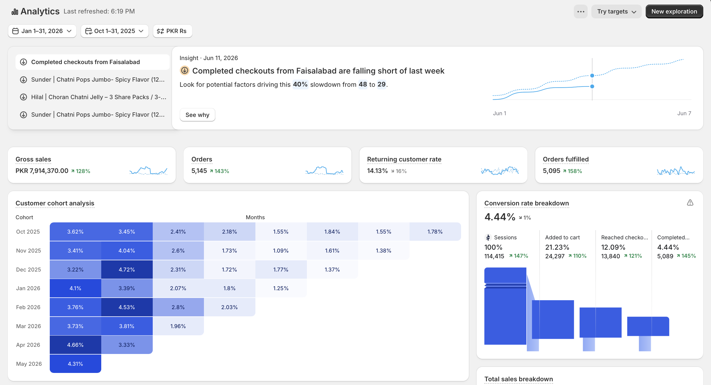

# Case Study: How I Revamped a Broken D2C Snacks Funnel to Achieve 128% Growth & a 10 ROAS in Pakistan

## Executive Summary
This case study details the strategic turnaround of a D2C food and snacks e-commerce brand in Pakistan by Abdullah Riaz. Within a 90-day trajectory (November to January 2026), the brand shifted from unprofitable, low-quality traffic and courier reconciliation crises to an omni-channel powerhouse—culminating in a 128% revenue expansion and an unprecedented 10 Return on Ad Spend (ROAS).

## 1. The Diagnostic Phase: Uncovering the Leakage (October)
When I audited the brand's digital ecosystem, the business was facing severe bottlenecks across four core pillars:
• Low-Quality Audience Acquisition: High traffic volumes were being generated from discarded audience segments, leading to low conversion rates and massive courier delivery failures (RTO/Non-delivery issues).
• Friction-Heavy Digital Real Estate: The Shopify landing pages lacked structural Conversion Rate Optimization (CRO), creating friction at the checkout point.
• Unoptimized Offer Structures: The product pricing and bundle deals did not properly incentivize a high Average Order Value (AOV).
• Single-Channel Dependency: The entire acquisition infrastructure was bottlenecked solely on Meta Ads, leaving the brand vulnerable to ad account instability.

## 2. The Strategy: The 4-Pillar Turnaround Framework
### Pillar A: Website CRO & Landing Page Reconstruction
I audited the customer journey and systematically removed friction from the Shopify interface. By restructuring the visual layout, building trust elements directly into the product modules, and simplifying the checkout funnel, we primed the site to convert high-intent buyers.

### Pillar B: Audience Quality Optimization
I shut down the broad, low-quality audience acquisition loops that were hurting fulfillment. Instead, I built high-intent custom data segments to attract customers who would actually accept and pay for cash-on-delivery orders, protecting the supply chain.

### Pillar C: Creative Testing & Offer Engineering
By running systematic creative testing cycles, we isolated the absolute winning video hooks and ad visuals. I combined these high-converting creatives with an optimized tier-based "Bundles & Deals" offer structure, driving up both the click-through rates (CTR) and the business's net margin.

### Pillar D: Omnichannel Launch (Meta, Google, & TikTok Ads)
To unlock compounding growth, I broke the single-channel dependency. I scaled the winning creative frameworks across a unified multi-channel ad matrix:
• Meta Ads Manager: Used for aggressive top-of-funnel narrative building and high-intent retargeting.
• TikTok Ads: Deployed to leverage high-engagement, localized product video reviews.
• Google Ads: Implemented Search and Performance Max funnels to capture explicit high-intent search volume.

## 3. The Result: A Majestic 10 ROAS
The cross-channel synergies delivered explosive results:
• 128% Net Revenue Expansion achieved in January.
• An exceptional 10 ROAS sustained across the localized Pakistani market ecosystem.
• Drastic reduction in courier reconciliation friction and a massive lift in profitability metrics.

## 4. Verified Performance Proof
Below is the verified dashboard trajectory showcasing the optimization scaling sequence:

---
### Strategic Strategy Architecture By:
• Professional Network: https://www.linkedin.com/in/theabdullahriaz/
• Personal Portfolio: https://www.aboutme.pk/abdullahriaz
